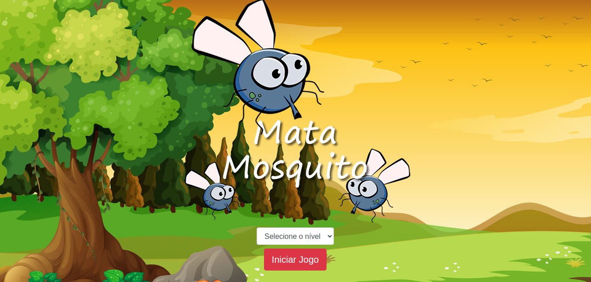

<h1 align="center">
    
</h1>

### app02_Udemy_Desenvolvimento_Web_Game-Mata-Mosquito

Game Mata-Mosquito


### Controlando os pontos de vida
Logica:
Se clicar no elemento ele deve ser removido e nada deve acontecer.

Se o elemento não for clicado antes do tempo termina o ponto deve ser removido.

1 - implementa o evento de click no mosquito e sua remoção:
    Inicialmento vamos só criar o evento de click de forma simples.
```js
 mosquito.onclick = function() {
    alert("Elemento clicado");
  }
```
    Agora vamos criar o evento de remoção  do elemento ao clicar nele.
    como a função está associada ao elemento html, eu posso usar o operador `this` fazendo referencia ao propio elemento html da função.
```js
mosquito.onclick = function() {
    this.remove()
  }
```

    Agora vamos criar o evento para tirar os pontos de vida caso termine o tempo.
    1 - Vamos na `<div class="vidas">` dentro dela vamos adicionar um `id` para as tag ``, ficando assim:
    E todas a imagem deve começa com o carração cheio
```html
    `
    <div class="vidas">
      
      
      
    </div>
    `
```
    2 - E vamos adicionar esse evento nessa função a baixo: 
```js
if(document.getElementById("mosquito")) {
    document.getElementById("mosquito").remove();
  }
```
Fazendo as seguntes alterações:
### 1 - Criar uma variavel global `var vidas = 1;` que vai receber `1`.

 ### 2 - Criar outra condição que o nosso limite seja ate tres:

```js
function posicaoRandonica() {
  //remover elemento (caso exista)
  if(document.getElementById("mosquito")) {
    document.getElementById("mosquito").remove();
    
    if(vidas > 3) {
      alert("Interroper o jogo!")
    }

    document.getElementById("v" + vidas).src = "../img/coracao_vazio.png";
    vidas++
  }
```

### 3 - Estabelece o fluxo de game ove

E dentro do controller vamos adicionar a seguinte linha de codigo. 
```js
  if(vidas > 3) {
    window.location.href = "../src/controller/fim_de_jogo.html"
  }else {
		document.getElementById('v' + vidas).src = "../img/coracao_vazio.png"

		vidas++
	}
```
### 3.1 - Vamos cria o arquivo `html`, da pagina fim de jogo
`fim_de_jogo.html`
E pegando as características dos componentes do Bootstrap, para ajudar a encaixar as imagens e o botão que serão utilizados nessa página.
Na pagina do `https://getbootstrap.com/`, vamos pegar o link cdn apenas do CSS only para utilizar em nosso codigo:
`https://maxcdn.bootstrapcdn.com/bootstrap/4.0.0/css/bootstrap.min.css`
```html
<!DOCTYPE html>
<html lang="en">
<head>
    <meta charset="UTF-8">
    <meta name="viewport" content="width=device-width, initial-scale=1.0">
    <title></title>
    <link rel="stylesheet" href="https://maxcdn.bootstrapcdn.com/bootstrap/4.0.0/css/bootstrap.min.css" integrity="sha384-Gn5384xqQ1aoWXA+058RXPxPg6fy4IWvTNh0E263XmFcJlSAwiGgFAW/dAiS6JXm" crossorigin="anonymous">

	<link rel="stylesheet" href="../style/estilo.css" />
</head>
<body>
    <div class="container">
        <div class="row">
            <div class="col">
                <div class="d-flex justify-content-center">
                    
                </div>
            </div>
        </div>
        <div class="row">
            <div class="col">
                <div class="d-flex justify-content-center">
                    <button type="button" class="btn btn-dark btn-lg" onclick="window.location.href = '../app.html' ">Reiniciar</button>
                </div>
            </div>
        </div>
    </div>    
</body>
</html>
```

### 4 - Criar o cronometro
```js
var cronometro = setInterval(function() {
  tempo -= 1
}, 1000);
```
E agora e so adicionar no `app.html` o segunte codigo na tag
```html
<div class="cronometro">Tempo restante: <span id="cronometro"></span></div>
```
E mais a abaixo adicionar a seguinte linha:
```html
<script>
  document.getElementById("cronometro").innerHTML = tempo;
    
  setInterval(function(){
    posicaoRandonica();      
  }, 2000);
</script>
```
E no arquivo anterior:
innerHTML = Tudo que esta entre as tag
```js
var cronometro = setInterval(function() {
  tempo -= 1
  document.getElementById("cronometro").innerHTML = tempo;
}, 1000);
```
Para corrigir os valores negativos, vamos criar uma lógica.
Fazendo um teste para verificar se o tempo é menor que zero.
E precisamos limpar a ocorrência do `alert` com o `clearInterval(cronometro);` passando para dentro da função a variável `cronometro` que contém a referência para a execução dessa função.
```js
var cronometro = setInterval(function() {
  tempo -= 1
  if(tempo < 0) {
    clearInterval(cronometro);
    clearInterval(criarMosquito);
    alert("vitoria")
  } else {
    document.getElementById("cronometro").innerHTML = tempo;
  }
}, 1000);
```

### 5 - Vitoria
E so segui a mesma logica de fim de jogo

### 6 Criação de uma pagina inicial para o jogo
Cria uma novo arquivo `index.html`
E copiar o conteudo do arquivo `vitoria.html`
1 - substituir a imagem vitoria.

2 - Cria os nivel
```html
<body>
    <div class="container">
        <div class="row">
            <div class="col">
                <div class="d-flex justify-content-center">
                    
                </div>
            </div>
        </div>
        <div class="row">
          <div class="col">
            <div class="d-flex justify-content-center">
              <div class="mb-2">
                <select class="form-control" id="nivel">
                  <option value="">--Selecione o nível--</option>
                  <option value="normal">Normal</option>
                  <option value="dificil">Dificil</option>
                  <option value="profissional">Profissional</option>
                </select>
              </div>
            </div>
          </div>
        </div>
        <div class="row">
            <div class="col">
                <div class="d-flex justify-content-center">
                    <button type="button" class="btn btn-danger btn-lg" onclick="iniciarJogo()">Iniciar Jogo</button>
                </div>
            </div>
        </div>
    </div>    
</body>
```
3 - E a logica basica para selecionar os nivel
```html
<script>
    function iniciarJogo() {
      var nivel = document.getElementById("nivel").value
      if(nivel === "") {
        alert("Selecione um nivel para iniciar um jogo")
        return false
      }
      alert(nivel)
    }
  </script>
```
### 7 Aplicar o nivel de iniciar o jogo na aplicação:
Na tag `<script>` a cima, vamos substituir o `alert` pelo seguinte codigo:
Só forçando ele para ir para pagina `app.html` ele ja direciona.
```html
window.location.href = "app.html";
```
Mas precisavos passar os parametros dos nivel de jogo.
Não seria a forma padrão mais a principio e para facio entendimento vamos fazer assim:
Vamos adicinar o `?` e concatenar com o `+` `nivel`
```html
window.location.href = "app.html?" + nivel;
```

E agora dentro do `dimensaoPaginaController.js`, vamos cria a logica que vai extrair o nivel que foi en caminhado como parametro para a pagina.
```js
var nivel = window.location.search;
```
E vamos colocar um alert apenas para ver o que estamos recebendo: `alert(nivel)`. 
Observe que irá trazer o parâmetro com o sinal `?` e queremos removê-lo. Para isso, vamos usar o `replace` e indicar o que deve ser ignorado e a partir de qual caractere o valor deve ser pego.
```js
alert(nivel.replace("?", " "));
```

Agora vamos novamente atribuir um valor para variavel `nivel`
```js
nivel = nivel.replace("?", " ");
```

Ainda no mesmo arquivo vamos criar uma variavel `criaMosquitoTempo`.
```js
var criaMosquitoTempo = 1500;
``` 
Passando ela tambem no arquivo `app.html`
```html
<script>
  document.getElementById("cronometro").innerHTML = tempo;
    
  var criarMosquito = setInterval(function(){
    posicaoRandonica();      
  }, criaMosquitoTempo);
</script>
```

E agora é só estabelecer uma condição. 
E nossa lógica vai ficar mais ou menos assim:
```js
var nivel = window.location.search;
nivel = alert(nivel.replace("?", " "));

if (nivel === "normal") {
  criaMosquitoTempo = 1500;
} else if (nivel === "dificil") {
  criaMosquitoTempo = 1000;
} else if (nivel === "profissional") {
  criaMosquitoTempo = 750;
}
```

